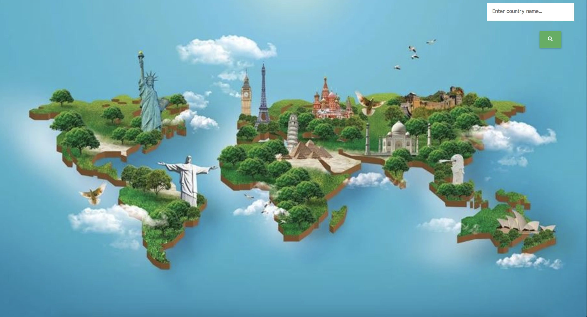
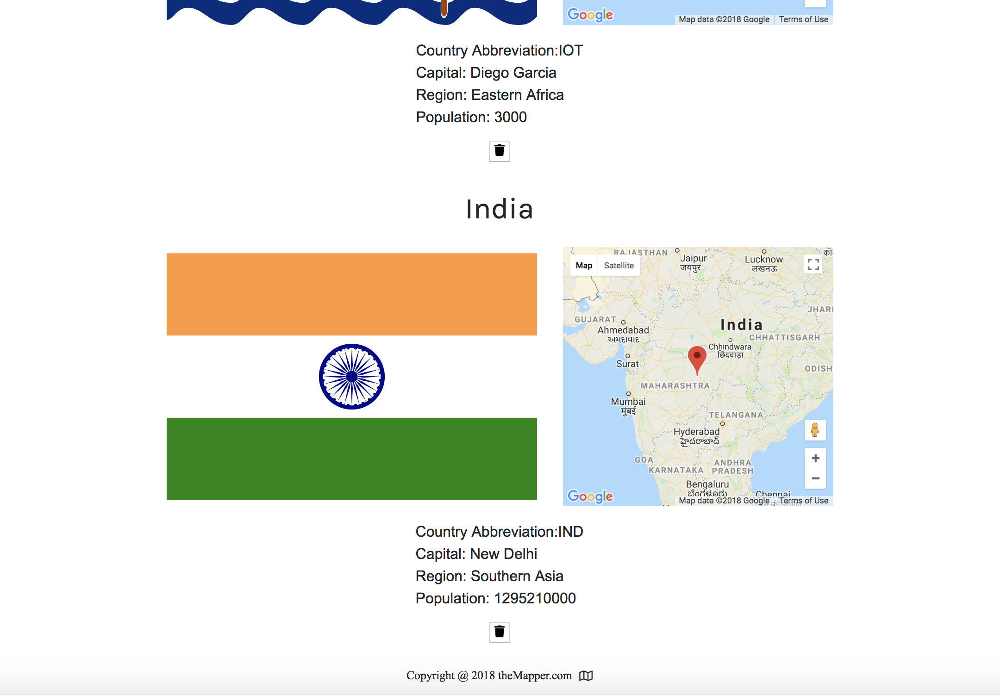
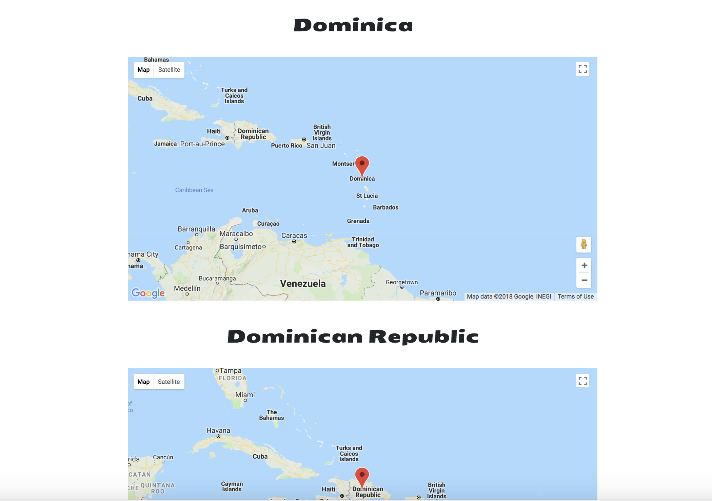
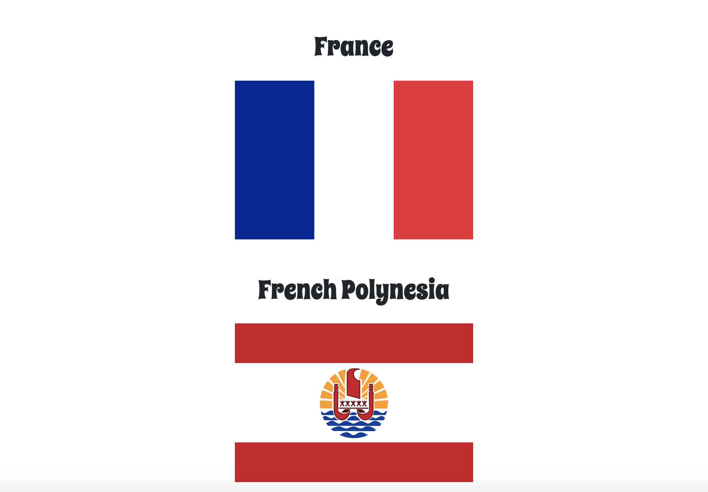

theMapper <i class="far fa-map"></i>

</img>

About

TheMapper is a web-based application created with React, Redux, and React Google Maps.  Simply enter the name of a country and the app will return its flag, demographics (e.g. capital), and pinned location.  Subsequent versions will offer greater customization and responsiveness.

Creator

Hutson D Olsen

Technologies Used

React
Redux
Node.js
Express
React Google Maps

Installation

MacOS:

npm run dev 

App Walkthrough

Home Screen (see above)

Here you will search for one or more countries.  

Results Screen

Click the second-from-left icon.  Your country's flag, map, and key demographics appear.

</img>

Map Screen

The next icon will take you to larger maps.  

</img>

Search History Screen

Even if you delete your results, your searches are stored.  

</img>

Development setup

This app requires the following dependencies:

    "react": "^16.4.1",
    "react-dom": "^16.4.1",
    "react-google-maps": "^9.4.5",
    "react-redux": "^5.0.7",
    "react-router-dom": "^4.3.1",
    "react-router-redux": "^4.0.8",
    "react-scripts": "1.1.4",
    "redux": "^4.0.0",
    "redux-thunk": "^2.3.0",
    "express": "^4.16.3"

Hutson Olsen – www.hutsondolsen.com – hdolsen@hutsondolsen.com

https://github.com/HDOlsen/theMapper.git
